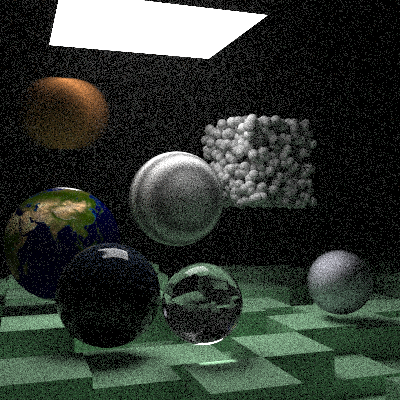
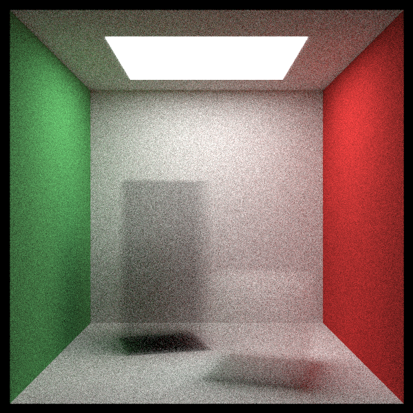
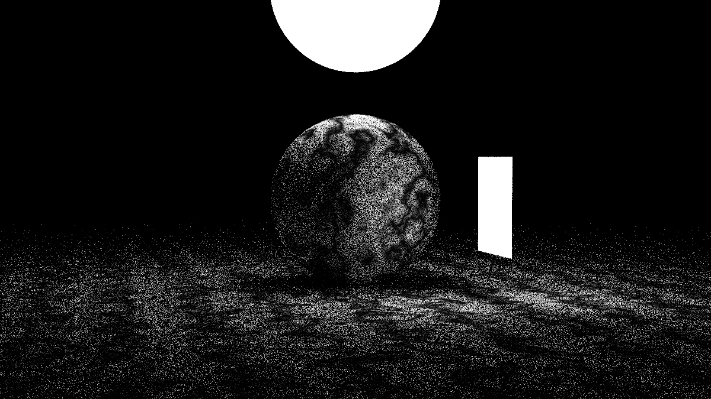
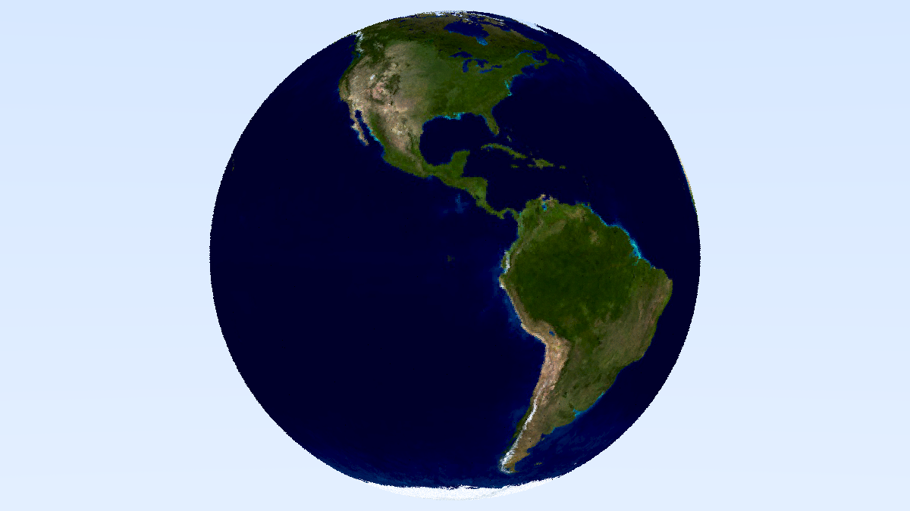
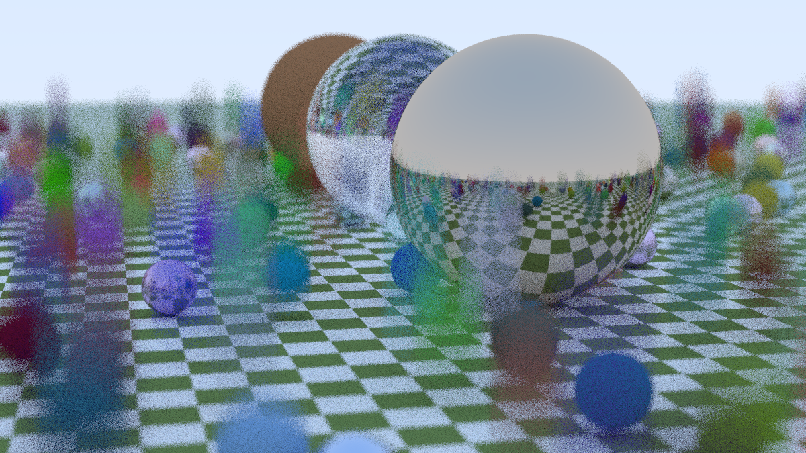

# Path Tracing in Rust

[](LICENSE)
[](https://www.rust-lang.org/tools/install)


This is a path tracer written in Rust that I built by following the [Ray Tracing: The Next Week](https://raytracing.github.io/books/RayTracingTheNextWeek.html) tutorial. It outputs a scene to a PPM image, which can be converted to a viewable PNG via your terminal or a website like [convertio](https://convertio.co/).

## Features

### New in Book 2
- Motion Blur
- Bounding Volume Hierarchies
- Texture Mapping
- Perlin Noise
- Quadrilateral Primitives
- Emissive Materials (Lights)
- Volumes
- Instances

### From Book 1
- Positionable camera with field of view and defocus blur
- Spheres and background colour
- Three material types:
    - **Lambertian** (appears matte, using gamma-corrected lambertian reflection)
    - **Metal** (shiny or fuzzy reflections)
    - **Dielectric** (glass-like reflection and refraction) 
- Multi-object scenes
- Antialiasing

## Development notes

I worked in Rust so that I wrote my own code, as the tutorial uses C++.

In this book I also organised my code into modules, and added some parallelisation in an attempt to speed up the rendering process.

## Installation and Running the Path Tracer

The code is currently setup to render the final scene in the book at a lower resolution than specified in the book (for a lower rendering time).

Requires Rust 1.84+.

```bash
git clone https://github.com/CarolineMillan/pathtracer_rs_bk2.git 
cd pathtracer_rs_bk2
cargo build
cargo run
```

There are currently no command‑line options — just `cargo run` to render the default scene.

This will output `rendered_image.ppm` in the project root. To convert it to a viewable format, you can either use a tool in the terminal (if you have it installed), or use an online converter like [convertio](https://convertio.co/) to go from PPM to PNG.

## Example Images 
Here are some of the images I rendered using this code. The rest can be found in the rendered_images folder.

**Note:** Final scene rendered at the lower resolution recommended in the tutorial (42 hours render time), and so the "global fog" covering the scene appears noisy and the blue volume inside glass looks washed out.







## Acknowledgements
- [Ray Tracing: The Next Week](https://raytracing.github.io/books/RayTracingTheNextWeek.html) tutorial
- Inspired by the original C++ code, fully reimplemented in Rust

## Licence
This software is available as open source under the terms of [the MIT Licence](https://opensource.org/license/MIT).